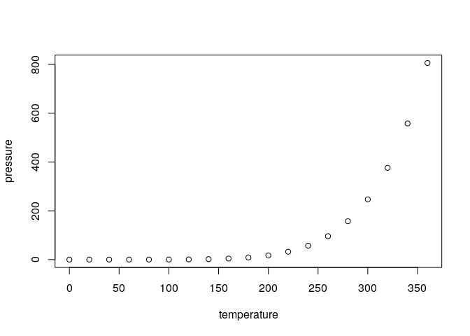

<!-- README.md is generated from README.Rmd. Please edit that file -->

# funHDDCwavelet – Functional High Dimension for Discrimination and Clustering

<!-- badges: start -->

[](https://travis-ci.org/Erwangf/funHDDC-wavelet)
[](https://www.tidyverse.org/lifecycle/#experimental)
<!-- badges: end -->

Perform time series clustering, via discrete wavelet transform, and
modeling wavelet coefficients with a parcimonious gaussian mixture
model. Parameter estimation is done with an EM algorithm.

## Installation

You can install the released version of funHDDCwavelet from
[CRAN](https://CRAN.R-project.org) with:

``` r
install.packages("funHDDCwavelet")
```

And the development version from [GitHub](https://github.com/) with:

``` r
# install.packages("devtools")
devtools::install_github("Erwangf/funHDDC-wavelet")
```

## Example

This is a basic example which shows you how to solve a common problem:

``` r
library(funHDDCwavelet)
#>    __             _   _ ____  ____   ____                         _      _   
#>   / _|_   _ _ __ | | | |  _ \|  _ \ / ___|_      ____ ___   _____| | ___| |_ 
#>  | |_| | | | '_ \| |_| | | | | | | | |   \ \ /\ / / _` \ \ / / _ \ |/ _ \ __|
#>  |  _| |_| | | | |  _  | |_| | |_| | |___ \ V  V / (_| |\ V /  __/ |  __/ |_ 
#>  |_|  \__,_|_| |_|_| |_|____/|____/ \____| \_/\_/ \__,_| \_/ \___|_|\___|\__|
#> 
#> 
#> 
## basic example code
```

What is special about using `README.Rmd` instead of just `README.md`?
You can include R chunks like so:

``` r
summary(cars)
#>      speed           dist       
#>  Min.   : 4.0   Min.   :  2.00  
#>  1st Qu.:12.0   1st Qu.: 26.00  
#>  Median :15.0   Median : 36.00  
#>  Mean   :15.4   Mean   : 42.98  
#>  3rd Qu.:19.0   3rd Qu.: 56.00  
#>  Max.   :25.0   Max.   :120.00
```

You’ll still need to render `README.Rmd` regularly, to keep `README.md`
up-to-date.

You can also embed plots, for example:



In that case, don’t forget to commit and push the resulting figure
files, so they display on GitHub\!

# Acknowledgements

This research benefited from the support of the FMJH ’Program Gaspard
Monge for optimization and operations research and their interactions
with data science’, and from the support from EDF and Thales.
